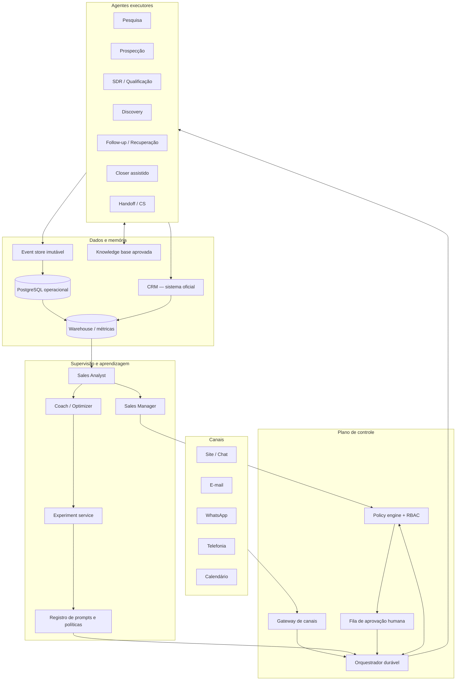
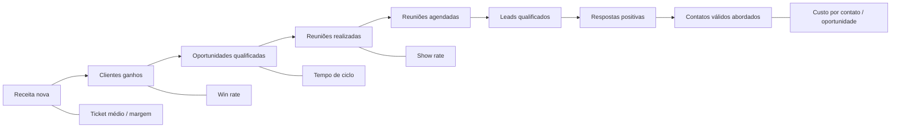
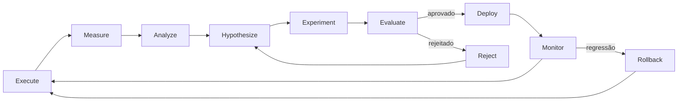

# Arquitetura de um Time Autônomo de Agentes de IA para Vendas

> Blueprint de referência para PMEs B2B de venda consultiva e ticket médio/alto
> Versão: 1.0 — 16 de setembro de 2026
> Escopo: metas, agentes, dados, experimentação, governança, stack e roadmap

## 1. Resumo executivo

A arquitetura recomendada não é um conjunto de bots livres para conversar entre si. É uma operação comercial governada por software, na qual:

1. o CRM continua sendo o sistema oficial de registro comercial;
2. um workflow durável controla estados, prazos, retries, idempotência e aprovações;
3. modelos de linguagem são usados somente nas etapas ambíguas — pesquisa, interpretação, redação, resumo e recomendação;
4. toda decisão e ação gera um evento auditável;
5. políticas determinísticas limitam o que cada agente pode fazer;
6. prompts, scripts e estratégias são versionados e promovidos apenas por experimentos controlados;
7. humanos mantêm autoridade sobre preço, contrato, promessa, risco jurídico, contas estratégicas e exceções.

O desenho tem quatro planos:

- **Plano de execução:** pesquisa, prospecção, qualificação, discovery assistido, follow-up, recuperação e handoff.
- **Plano de controle:** orquestrador, policy engine, filas, limites, aprovações e supervisor.
- **Plano de dados:** CRM, event store, warehouse, memória e base oficial de conhecimento.
- **Plano de aprendizagem:** avaliação, análise causal, experimentos, registro de versões, promoção e rollback.

Uma heurística inicial para PMEs é implementar aproximadamente **70% do fluxo como automação determinística, 25% como workflows fixos com LLM e no máximo 5% como decisão agentiva aberta**. Essa proporção não é benchmark de mercado; é um ponto de partida de engenharia para controlar risco. A complexidade deve subir apenas quando houver ganho mensurável. Essa abordagem é coerente com as recomendações de começar pela solução mais simples e reservar agentes para decisões flexíveis sobre dados não estruturados, descritas pela [OpenAI](https://openai.com/business/guides-and-resources/a-practical-guide-to-building-ai-agents/) e pela [Anthropic](https://www.anthropic.com/engineering/building-effective-agents).

## 2. O que é automação, workflow com LLM e agente autônomo

| Categoria | Quem escolhe o próximo passo | Exemplo comercial | Previsibilidade | Uso recomendado |
|---|---|---|---|---|
| Automação determinística | Código/regra | “Se consentimento válido e SLA expirado, criar tarefa” | Alta | Estados, cadências, compliance, cálculo, roteamento simples |
| Workflow com LLM | Grafo fixo; LLM executa uma etapa | Extrair dor, classificar objeção, redigir rascunho e validar | Média-alta | Maior parte das interações assistidas |
| Agente limitado | LLM escolhe entre ferramentas permitidas | Pesquisar conta, selecionar material aprovado, propor próximo passo | Média | Pesquisa e atendimento dentro de limites claros |
| Agente aberto | LLM define plano e ações até atingir a meta | “Feche este negócio como achar melhor” | Baixa | Não recomendado em produção comercial consequencial |

Autonomia não deve ser um atributo global do agente. Deve ser uma permissão por **ação + contexto + valor + reversibilidade + confiança**. O mesmo SDR virtual pode enviar automaticamente um material aprovado a um lead com opt-in e, ao mesmo tempo, ser proibido de responder sobre cláusulas de responsabilidade.

## 3. Arquitetura de referência



### Organograma operacional

```text
Responsável humano por Receita
├── Comitê de governança: Vendas + Marketing + Jurídico/Privacidade + Operações
├── Sales Manager Agent (observa, prioriza e aplica políticas)
│   ├── Pesquisa e enriquecimento
│   ├── Prospecção
│   ├── SDR e qualificação
│   ├── Discovery assistido
│   ├── Follow-up e recuperação
│   ├── Closer assistido
│   └── Handoff e Customer Success
└── Núcleo de aprendizagem
    ├── Sales Analyst
    ├── Coach / Optimizer
    └── Serviço de experimentação e registro de versões
```

O “Sales Manager Agent” deve ser composto, e não um único prompt: regras determinísticas controlam permissão e orçamento; análises estatísticas detectam desvios; o LLM explica, resume e recomenda.

## 4. Matriz completa de agentes

### Escala de autonomia

- **A0 — observar:** lê e recomenda; não altera sistemas.
- **A1 — preparar:** produz rascunho, score ou tarefa; humano executa.
- **A2 — executar reversível:** atua automaticamente em ações de baixo risco, dentro de política.
- **A3 — executar condicionado:** atua dentro de limites quantitativos, com monitoramento e kill switch.
- **A4 — reservado a humanos:** decisão consequencial ou excepcional.

| Agente | Objetivo | Entradas | Ferramentas | Decisões e ações permitidas | Outputs | KPIs principais | Autonomia e escalonamento |
|---|---|---|---|---|---|---|---|
| Pesquisa/enriquecimento | Completar contexto verificável de conta e contato | Domínio, nome, CRM, ICP | APIs de enriquecimento, busca autorizada, CRM, KB | Resolver identidade, coletar sinais públicos, deduplicar; nunca inferir dado sensível | Dossiê com fontes, confiança e validade | Cobertura, precisão auditada, custo por registro, freshness | A2; escalar conflito de identidade, dado sensível ou fonte duvidosa |
| Prospecção | Selecionar contas e contatos elegíveis | ICP, território, capacidade, exclusões | CRM, intent data, listas autorizadas | Rankear, montar lista, aplicar supressões e frequência | Fila priorizada com reason codes | ICP fit, aceitação pelo SDR, pipeline por 1.000 contas, opt-out/complaint rate | A2; humano aprova novos segmentos, fontes e campanhas em massa |
| SDR | Iniciar e sustentar conversa de baixo risco | Lead priorizado, contexto, cadência, templates | E-mail/chat/WhatsApp autorizado, CRM, calendário, KB | Personalizar mensagem aprovada, responder FAQ, oferecer agenda, registrar opt-out | Interações e próxima ação | Reply, positive reply, meeting booked, SLA, complaint rate | A2/A3 para canais e volumes aprovados; escalar intenção de compra, irritação, ambiguidade e pergunta não coberta |
| Qualificação | Determinar fit, interesse e prontidão | Conversa, dados firmográficos, critérios ICP | CRM, formulário, KB, scoring | Fazer perguntas permitidas, classificar MQL/SQL, desqualificar com reason code | Score, evidências, campos faltantes, rota | Precisão de SQL, aceitação pelo AE, conversão SQL→oportunidade, falso positivo/negativo | A2 para score; humano revisa contas estratégicas e rejeições de alto valor |
| Discovery | Estruturar problema, impacto, processo e próximos passos | Reunião/transcrição, framework de discovery | Call recording consentido, transcrição, CRM, KB | Sugerir perguntas, resumir, extrair MEDDICC/BANT; não conduzir sozinho discovery complexo | Brief, gaps, riscos, plano de reunião | Completude, aceitação do resumo, reunião→oportunidade, tempo poupado | A1; humano lidera a reunião e valida fatos e compromisso |
| Follow-up | Manter momentum e cumprir SLAs | Estágio, compromissos, histórico, disponibilidade | CRM, e-mail, calendário, KB | Enviar recap aprovado, lembrete e conteúdo; ajustar timing dentro de faixa | Mensagem, tarefa, novo next step | Resposta, stage progression, aging, no-show recovery | A2; escalar silêncio após limite, objeção nova ou pedido comercial |
| Recuperação | Reativar leads inativos, no-shows e closed-lost elegíveis | Motivo de perda, última interação, janela de reabertura | CRM, enrichment, e-mail, sinais de intenção | Selecionar elegíveis, personalizar reentrada, encerrar cadência | Reativação ou motivo atualizado | Reactivation rate, oportunidades recuperadas, receita recuperada, opt-out | A2; excluir “do not contact”, disputas e perdas por confiança/jurídico |
| Closer/negociação | Apoiar avanço e coerência comercial | Discovery validado, proposta, política de preço | CPQ, CRM, KB, calculadora ROI | Recomendar pacote, preparar proposta, simular cenários e registrar objeções | Proposta em rascunho, plano de negociação | Win rate, desconto, margem, ciclo, forecast accuracy | A1; preço final, desconto, contrato e compromisso são A4/humanos |
| Handoff/Customer Success | Transferir contexto sem perda e acelerar time-to-value | Closed-won, contrato, expectativas, riscos | CRM, CS platform, tarefas, KB | Criar brief, kickoff, checklist e alertas; não reinterpretar contrato | Dossiê de handoff, plano inicial, owners | Tempo de handoff, completude, rework, ativação, early churn | A2 para tarefas; escalar divergência entre venda e contrato/promessa |
| Sales Manager | Otimizar alocação respeitando políticas | Capacidade, SLA, KPIs, riscos, experimentos | Orquestrador, policy engine, warehouse, alertas | Distribuir filas, pausar automação, aplicar limites e recomendar mudança | Prioridades, incidentes, relatório e ações | Pipeline velocity, SLA, cobertura, qualidade, incidentes, custo por oportunidade | A3 para roteamento e pausa; A4 para meta, preço, política, campanha ampla e orçamento relevante |
| Sales Analyst | Transformar eventos em evidência | Event store, CRM, versões, custos e resultados | SQL, warehouse, BI, notebooks estatísticos | Calcular métricas, detectar anomalia, segmentar e estimar efeito | Scorecards, alertas, análises causal/descritiva | Latência de dados, reconciliação, precisão de alertas, hipóteses úteis | A0/A1; não muda produção nem declara causalidade sem desenho adequado |
| Coach/Optimizer | Propor melhorias testáveis | Análises, falhas rotuladas, feedback humano, transcripts | Evals, prompt registry, sandbox, experiment service | Criar candidata de prompt/script, rodar testes offline, propor experimento | Versão candidata, hipótese, riscos, plano de teste | Uplift validado, regressões, taxa de promoção, rollback | A1; nunca autoedita versão de produção; promoção segue gate |

## 5. Sistema de metas e performance

### Árvore de métricas



### Conversão reversa da meta

Para um período (T):

```text
clientes_necessários     = receita_alvo / ticket_médio
oportunidades_necessárias = clientes_necessários / win_rate
reuniões_realizadas      = oportunidades_necessárias / taxa_reunião_para_oportunidade
reuniões_agendadas       = reuniões_realizadas / show_rate
qualificados             = reuniões_agendadas / taxa_qualificado_para_reunião
respostas_positivas      = qualificados / taxa_resposta_para_qualificação
contatos                 = respostas_positivas / positive_reply_rate
```

Exemplo B2B consultivo por trimestre:

| Premissa | Valor |
|---|---:|
| Receita nova alvo | R$ 1.200.000 |
| Ticket médio | R$ 100.000 |
| Win rate oportunidade→ganho | 25% |
| Reunião realizada→oportunidade | 40% |
| Show rate | 75% |
| Qualificado→reunião agendada | 40% |
| Resposta positiva→qualificado | 30% |
| Contato→resposta positiva | 8% |

Resultado aproximado: **12 ganhos → 48 oportunidades → 120 reuniões realizadas → 160 agendadas → 400 qualificados → 1.334 respostas positivas → 16.675 contatos válidos**.

Esse cálculo é um modelo de capacidade, não uma promessa. Taxas devem ser estimadas por canal, segmento e origem usando coortes históricas. Em vendas de ciclo longo, usar valor esperado e atraso de conversão para evitar atribuir receita prematuramente.

### Meta empresarial → meta do agente

| Camada | Exemplo | Owner | Guardrail obrigatório |
|---|---|---|---|
| Empresa | R$ 1,2 mi de receita nova | Humano de Receita | Margem, churn inicial, compliance |
| Funil | 48 oportunidades aceitas | Sales Manager | Critério de oportunidade congelado |
| Agente | SDR: 160 reuniões; Qualificação: 400 SQLs | Agente + gestor | Show rate, aceitação AE, complaint rate |
| Ação | 16.675 contatos distribuídos em cadências | Orquestrador | Consentimento/base legal, frequência, capacidade |
| Resultado | Respostas, SQLs, reuniões, oportunidades | Warehouse | Deduplicação e janela de atribuição |
| Feedback | Ajustar segmento, mensagem ou timing via teste | Analyst/Coach | Controle, amostra, aprovação e rollback |

Cada agente recebe uma métrica primária e duas classes de guardrail:

- **Qualidade downstream:** um SDR não é premiado só por reuniões, mas por reuniões realizadas e oportunidades aceitas.
- **Risco/custo:** opt-outs, reclamações, alucinações, descontos, custo por oportunidade e carga de revisão humana.

## 6. Observabilidade e modelo de dados

### Princípio de registro

O CRM contém o estado comercial atual. O **event store append-only** contém a verdade auditável de como esse estado foi produzido. O warehouse transforma eventos em métricas. Não sobrescrever a história; publicar eventos corretivos.

### Entidades mínimas

| Entidade | Campos essenciais |
|---|---|
| `account` | id, domínio, segmento, ICP, porte, território, origem, owner, consent/status, data-quality score |
| `contact` | id, account_id, cargo/persona, canais, preferências, consentimentos, supressões, proveniência |
| `lead` | id, contact_id, source, campaign, status, score, reason_codes, created_at |
| `interaction` | id, lead_id, channel, direction, timestamp, content_ref, template/prompt version, CTA, sentiment, objections |
| `agent_run` | run_id, agent_id/version, model/version, input refs, tool calls, tokens/cost, start/end, status |
| `decision` | decision_id, run_id, decision_type, alternatives, selected, reason_codes, confidence, policy result |
| `action` | action_id, decision_id, tool, exact payload hash, approval_id, idempotency_key, result |
| `stage_event` | opportunity_id, from_stage, to_stage, timestamp, actor, reason, amount, probability |
| `outcome` | entity_id, outcome_type, value, occurred_at, attribution_window, verified_by |
| `prompt_policy_version` | artifact_id, semantic version, checksum, owner, status, effective dates, rollback target |
| `experiment` | hypothesis, unit, population, variants, allocation, primary metric, guardrails, sample plan, status |
| `experiment_assignment` | experiment_id, unit_id, variant, assigned_at; imutável |
| `approval` | request, exact payload hash, risk, approver, decision, timestamp, expiry |
| `knowledge_item` | source, owner, version, validity, audience, approval status, citation |
| `feedback` | human label, type, severity, evidence, target run/interaction, adjudicator |

### Envelope padrão de evento

```json
{
  "event_id": "evt_01...",
  "event_type": "sales.message.sent.v1",
  "occurred_at": "2026-09-16T14:30:00Z",
  "tenant_id": "org_123",
  "lead_id": "lead_456",
  "account_id": "acct_789",
  "correlation_id": "journey_abc",
  "causation_id": "decision_def",
  "actor": {"type": "agent", "id": "sdr", "version": "3.4.1"},
  "channel": "email",
  "experiment": {"id": "exp_77", "variant": "B"},
  "artifacts": {
    "prompt_version": "sdr-email@3.4.1",
    "policy_version": "outbound-br@2.2.0",
    "knowledge_snapshot": "kb_2026_09_15"
  },
  "decision": {
    "intent": "offer_discovery_call",
    "reason_codes": ["ICP_MATCH", "RECENT_INTENT"],
    "confidence": 0.91
  },
  "action": {
    "tool": "email.send",
    "payload_hash": "sha256:...",
    "idempotency_key": "lead_456:cadence_9:step_2"
  },
  "privacy": {"pii_class": "restricted", "retention_policy": "sales_24m"}
}
```

Conteúdo integral de e-mail, chat e transcrição deve ficar em armazenamento protegido; o event log referencia o conteúdo por ID e hash. Logs técnicos não devem duplicar PII.

### Reconstrução da jornada

`correlation_id` liga a jornada ponta a ponta; `causation_id` liga cada evento ao evento ou decisão que o causou; versões explicam qual comportamento estava ativo. Assim é possível responder:

```text
Lead → atribuição de variante → pesquisa → decisão → mensagem → resposta
→ qualificação → reunião → oportunidade → proposta → ganho/perda
```

## 7. Sales Analyst: análise de performance

### Rotina analítica

1. **Reconciliação:** eventos vs. CRM vs. canal; detectar perda, duplicidade e atraso.
2. **Descrição:** funil por coorte, canal, segmento, agente e versão.
3. **Diagnóstico:** decompor queda por mix, etapa, qualidade de dados e comportamento.
4. **Hipótese:** formular mecanismo e efeito esperado antes de testar.
5. **Causalidade:** usar randomização quando possível; métodos observacionais apenas como indício.
6. **Decisão:** traduzir evidência para manter, pausar, testar ou escalar.

### Perguntas e métodos

| Pergunta | Método apropriado | Risco de erro |
|---|---|---|
| Qual mensagem recebe mais resposta? | A/B por lead/conta, mesma população e janela | Mistura de segmentos, horário e reputação do remetente |
| Qual segmento converte melhor? | Coortes + regressão com controles | Seleção: melhores leads podem ter recebido mais atenção |
| Onde há abandono? | Funil e análise de sobrevivência | Estágios mal preenchidos ou mudança de definição |
| Qual agente performa melhor? | Ajuste por mix/propensão + qualidade downstream | Comparar carteiras de dificuldades diferentes |
| Estratégia está deteriorando? | Controle estatístico, drift de mix e séries temporais | Sazonalidade e atraso de receita |
| O que reduz ciclo? | Survival analysis; experimento quando possível | Excluir negócios ainda abertos gera survivorship bias |
| Que sequência funciona? | Teste randomizado de cadência | Contaminação se o mesmo account recebe variantes |

### Correlação não é causalidade

- “Leads com sete interações fecham mais” pode significar que leads promissores recebem mais esforço; não que sete contatos causem fechamento.
- “Agente X tem maior win rate” pode refletir carteira mais madura.
- “Mensagem A ganhou” pode refletir distribuição desigual ou **sample ratio mismatch**. A Microsoft recomenda validar SRM antes de interpretar um teste, pois um desvio entre a alocação esperada e observada pode indicar viés de instrumentação ou seleção ([Microsoft Research](https://www.microsoft.com/en-us/research/publication/diagnosing-sample-ratio-mismatch-in-online-controlled-experiments-a-taxonomy-and-rules-of-thumb-for-practitioners/)).

### Amostras pequenas

- Pré-definir efeito mínimo detectável, poder estatístico, alfa, janela e métrica primária.
- Não usar “30 por grupo” como regra universal.
- Exemplo: para detectar aumento de 5% para 6% de conversão, teste bilateral com 5% de significância e 80% de poder requer aproximadamente **8.158 unidades por variante**; de 20% para 24%, aproximadamente **1.683 por variante**.
- Em baixo volume, usar métricas de etapa mais frequente como sinal rápido, mas só promover se guardrails downstream estiverem estáveis.
- Acumular evidência com modelos bayesianos hierárquicos pode reduzir variância entre segmentos, porém não substitui randomização nem autoriza “peeking” arbitrário.
- Para receita, manter o teste por pelo menos uma janela de maturação predefinida, frequentemente um ou dois ciclos de venda.
- Tratar resultados de subgrupos como exploratórios até replicação.

## 8. Ciclo de aprendizagem e melhoria controlada



### O que pode ser otimizado

| Componente | Gerar candidato automaticamente | Promover automaticamente | Condição |
|---|---:|---:|---|
| Prompt interno de extração | Sim | Sim, baixo risco | Evals offline, schema válido, sem mudança de ação externa |
| Abertura, CTA, tom e script | Sim | Condicional | A/B, limites de marca, métricas e rollback |
| Perguntas de qualificação | Sim | Condicional | Não pode alterar definição oficial de SQL |
| Timing e número de follow-ups | Sim | Condicional | Dentro de frequência, janela e política do canal |
| Segmentação e priorização | Sim | Condicional | Auditoria de viés, exclusões e capacidade |
| Tratamento de objeções | Sim | Humano/experimento | Conteúdo somente da KB; temas sensíveis escalam |
| Preço, desconto e pacote contratual | Pode recomendar | Não | Aprovação comercial humana |
| Política, compliance e fontes oficiais | Não | Não | Owner autorizado e trilha de mudança |

### Registro de versão

Cada prompt, política e conjunto de tools precisa de:

`artifact_id`, versão semântica, owner, hipótese, modelo compatível, tools permitidas, dataset de avaliação, resultados, aprovação, período de vigência, hash, dependências e `rollback_to`.

Nenhum agente escreve diretamente no prompt ativo. O Coach cria uma **versão candidata**; o pipeline executa evals; o Experiment Service distribui tráfego; a promoção é uma mudança de configuração auditada.

### Gates de promoção

Uma variante só avança quando:

1. instrumentação passou em A/A, SRM, duplicidade e perda de eventos;
2. atingiu tamanho ou critério sequencial pré-definido;
3. melhoria da métrica primária supera o efeito mínimo relevante;
4. não deteriorou guardrails além do limite;
5. custo incremental por oportunidade permanece aceitável;
6. resultado é estável nos segmentos críticos ou diferenças são entendidas;
7. não houve incidente crítico de política;
8. recebeu aprovação proporcional ao risco.

Rollback automático ocorre por limite operacional, não por interpretação livre do LLM: aumento abrupto de opt-out/complaint, falha de entrega, queda de qualidade, custo excedido, erro de integração ou violação de política.

## 9. Infraestrutura permanente de experimentação

### Desenho padrão

```text
Hipótese: trocar apenas o CTA aumenta meeting rate sem elevar opt-out.
Unidade: account_id (evita pessoas da mesma empresa em variantes distintas).
Controle: script atual.
Variante A: novo CTA.
Alocação: 50/50 estratificada por segmento, canal e origem.
Primária: reunião realizada por account elegível.
Secundárias: resposta positiva, oportunidade aceita, receita madura.
Guardrails: opt-out, complaint, no-show, custo, incidentes e revisão humana.
Janela: definida antes do início; atribuição imutável.
```

Para identificar a causa, alterar **uma dimensão por experimento**. Quando for necessário testar abertura e CTA simultaneamente, usar desenho fatorial 2×2 com amostra suficiente e análise explícita de interação. Não lançar A/B/C com mensagem, público, remetente, timing e oferta diferentes e depois atribuir a diferença a um único elemento.

Bandits são úteis para resultados rápidos e frequentes; vendas consultivas têm feedback atrasado e risco de otimizar proxy. Começar com A/B clássico. Usar bandit somente quando a métrica for madura rapidamente, a instrumentação estiver estável e houver exploração mínima obrigatória.

## 10. Sales Manager / Supervisor

### Pode alterar automaticamente

- atribuição e prioridade de leads segundo regras aprovadas;
- capacidade de fila e throttling dentro de faixas;
- retries, SLA e canal alternativo permitido;
- pausa de campanha ou versão ao violar guardrail;
- escolha entre conteúdos já aprovados;
- alocação de experimento conforme desenho congelado;
- geração de tarefas e alertas;
- resumo executivo e recomendação.

### Exige aprovação humana

- meta ou definição oficial do funil;
- novo público, fonte de dados ou base legal;
- campanha em massa ou aumento material de volume;
- alteração de preço, desconto, margem ou termos;
- resposta jurídica, promessa não documentada ou exceção;
- acesso a dado confidencial ou sensível;
- desbloqueio de conta em supressão;
- promoção de versão de risco médio/alto;
- decisão sobre cliente estratégico ou crise/reclamação.

### Kill switches

Devem existir por organização, canal, campanha, agente, ferramenta e versão. O supervisor pode **reduzir autonomia ou pausar**, mas não aumentar o próprio limite.

## 11. Memória e knowledge base

| Camada | Conteúdo | Atualização automática | Controle |
|---|---|---|---|
| Memória do lead | Fatos, mensagens, preferências, objeções, compromissos, consentimento e próximos passos | Eventos podem ser anexados; resumos são derivados e marcados | Fonte, timestamp, confiança, retenção e direito de correção/exclusão |
| Memória comercial | Padrões agregados por persona, segmento, objeção, canal e estratégia | Métricas e hipóteses podem ser recalculadas | Não transformar correlação em “verdade”; revisão e validade temporal |
| Knowledge base oficial | Produto, preço, oferta, cases, concorrentes, políticas, contratos e FAQ | Ingestão pode ser automatizada; publicação não | Owner, versão, aprovação, validade, ACL e citação obrigatória |

Regras críticas:

- separar fato observado de inferência do modelo;
- registrar a fonte e a data de cada fato;
- aplicar TTL a informações mutáveis;
- não gravar raciocínio livre do agente como verdade oficial;
- respostas de preço, contrato e política devem citar versão aprovada;
- embeddings são índice de recuperação, não sistema oficial de registro;
- aplicar ACL antes da recuperação, não depois da geração.

## 12. Human-in-the-loop, segurança e governança

### Matriz de decisão

| Risco | Exemplos | Regra |
|---|---|---|
| Baixo e reversível | Enriquecer CRM, criar tarefa, rascunhar resumo | Automático com auditoria |
| Médio e externo | Enviar mensagem aprovada, agendar reunião | Automático dentro de limites; amostragem humana |
| Alto comercial | Desconto, proposta, mudança de pacote, forecast estratégico | Aprovação explícita |
| Alto jurídico/reputacional | Contrato, reclamação, promessa, dado sensível, incidente | Bloquear e escalar |

### Controles mínimos

- RBAC e credenciais por agente; nunca compartilhar credencial humana ampla.
- Tool allowlist e parâmetros validados por schema.
- Separação entre “propor ação” e “executar ação”.
- Aprovação vinculada ao hash exato do payload; mudança invalida aprovação.
- Idempotency key em toda ação externa.
- Orçamento por execução, lead, campanha e dia.
- Limite de passos, tempo e chamadas de ferramenta.
- Proteção contra prompt injection em e-mails, páginas e documentos recuperados.
- Redação/mascaramento de PII em traces; criptografia e retenção.
- Avaliações adversariais antes de cada aumento de autonomia.
- Log de quem alterou política, prompt, ferramenta, KB e experimento.
- Runbooks de incidente, rollback e comunicação.

Frameworks atuais já oferecem mecanismos úteis, mas eles não substituem policy engine. O OpenAI Agents SDK registra gerações, tool calls, handoffs e guardrails em tracing ([documentação de tracing](https://openai.github.io/openai-agents-python/tracing/)); o LangGraph oferece interrupções persistentes para aprovação humana ([documentação](https://langchain-ai.github.io/langgraph/concepts/breakpoints/)); e o n8n permite exigir revisão antes de determinadas tool calls ([documentação](https://github.com/n8n-io/n8n-docs/blob/main/docs/build/integrate-ai/ai-examples/human-in-the-loop-for-tools.md)).

### Privacidade e compliance

Para operações brasileiras, documentar finalidade, necessidade, base legal, transparência, retenção, direitos do titular e compartilhamentos. O guia da ANPD sobre legítimo interesse exige análise de finalidade, necessidade, balanceamento e salvaguardas e deixa claro que a hipótese não se aplica a dados pessoais sensíveis ([ANPD](https://www.gov.br/anpd/pt-br/assuntos/noticias/anpd-lanca-guia-orientativo-sobre-legitimo-interesse)). A ANPD também mantém em pauta parâmetros para revisão de decisões automatizadas sob o art. 20 da LGPD ([agenda regulatória](https://www.gov.br/anpd/pt-br/assuntos/regulacao/agenda-regulatoria-1)).

Além da LGPD, respeitar opt-in/opt-out, listas de supressão, termos dos canais e legislação local de marketing. Para atuação internacional, mapear GDPR/ePrivacy e regras aplicáveis; na União Europeia, a maior parte das regras do AI Act passou a ser aplicável em agosto de 2026, com cronograma específico por obrigação ([Comissão Europeia](https://ai-act-service-desk.ec.europa.eu/en/ai-act/eu-ai-act-implementation-timeline)). A validação jurídica deve ser feita por profissional habilitado.

## 13. Stack tecnológico em três versões

### Versão A — MVP econômico

| Camada | Recomendação | Observação |
|---|---|---|
| CRM | HubSpot ou Pipedrive | Escolher um; não criar CRM próprio |
| Orquestração | n8n self-host/cloud | Workflows visuais, aprovações e integrações |
| LLM | Um provedor principal + fallback manual | Saída estruturada e orçamento por tarefa |
| Dados | PostgreSQL/Supabase + storage | Tabelas operacionais e event log inicial |
| RAG | `pgvector` no mesmo Postgres | Evita banco vetorial separado no início |
| Canais | E-mail transacional/comercial, WhatsApp Business oficial, calendário | Preservar consentimento e opt-out |
| Analytics | Metabase ou Looker Studio | Funil, SLA, custo e guardrails |
| Observabilidade | Logs estruturados + tracing do framework | Redação de PII |

**Escopo:** pesquisa assistida, triagem inbound, rascunho, follow-up limitado e handoff. Um agente lógico pode executar vários papéis; não criar 12 serviços físicos no MVP.

### Versão B — arquitetura intermediária

| Camada | Recomendação | Observação |
|---|---|---|
| CRM | HubSpot Professional/Enterprise ou Salesforce | Webhooks e objetos bem governados |
| Orquestração | LangGraph ou OpenAI Agents SDK + fila de jobs | Estado explícito, handoffs e guardrails |
| Workflow longo | Temporal ou mecanismo equivalente | Recomendado para esperas de dias, retries e aprovação; Temporal persiste e retoma execução após falhas ([docs](https://docs.temporal.io/)) |
| Dados | PostgreSQL operacional + BigQuery/Snowflake | Separar transacional de analítico |
| Transformação | dbt | Métricas versionadas |
| RAG | pgvector ou serviço vetorial gerenciado | ACL, versão e citações |
| Observabilidade | OpenTelemetry + Langfuse/Arize/Phoenix ou tracing do SDK | Traces, custos, datasets e evals |
| Experimentação | Serviço simples próprio + feature flags | Atribuição imutável e métricas pré-registradas |

**Escopo:** multiagente lógico, supervisor, experimentos formais, recovery e analytics causal básico.

### Versão C — arquitetura avançada

| Camada | Recomendação | Observação |
|---|---|---|
| CRM/CDP | Salesforce + Data Cloud, Dynamics ou stack enterprise equivalente | Governança e identidade unificada |
| Execução durável | Temporal + serviços próprios de agentes | Isolamento, replay, compensação e longa duração |
| Eventos | Kafka/Pub/Sub/Kinesis + schema registry | Alto volume e desacoplamento |
| Dados | Lakehouse/warehouse + dbt + catálogo | Lineage e políticas por coluna |
| Model gateway | Gateway multi-modelo próprio | Roteamento por risco, custo, latência e qualidade |
| Evals | Plataforma de avaliação offline/online + red team contínuo | Regression gates e canary |
| Experimentação | Plataforma própria com SRM, sequential testing e holdouts | Governança central |
| Segurança | DLP, SIEM, KMS, secrets manager, ABAC e audit lake | Separação de funções |

**Escopo:** múltiplos mercados/canais, alto volume, otimização contínua e SLOs formais. Só se justifica quando volume, risco ou integração superarem claramente o custo operacional.

### Low-code/no-code vs. implementação própria

| Critério | Low-code/no-code | Própria |
|---|---|---|
| Time-to-value | Dias/semanas | Semanas/meses |
| Flexibilidade | Média | Alta |
| Auditabilidade | Varia por fornecedor | Alta se projetada corretamente |
| Durabilidade/replay | Limitada a média | Alta com workflow engine |
| Custo inicial | Menor | Maior |
| Custo em escala | Pode crescer por execução/crédito | Pode ser otimizado, mas exige equipe |
| Lock-in | Médio/alto | Menor no core, maior custo de manutenção |
| Melhor uso | MVP e integração | Fluxos críticos, diferenciação e escala |

Recomendação: **comprar o commodity e construir a diferenciação**. CRM, e-mail, WhatsApp, telefonia e calendário são comprados; política, dados, atribuição, experimentação e inteligência comercial própria ficam sob controle da empresa.

### Métrica econômica

```text
custo_por_oportunidade_aceita =
  (licenças + modelos + enriquecimento + canais + infraestrutura
   + revisão_humana + falhas/retrabalho) / oportunidades_aceitas
```

Medir também margem de contribuição, não apenas custo de token. Em venda de ticket alto, um sistema mais caro pode ser superior se elevar a qualidade downstream; em alto volume e baixo ticket, latência e custo por contato tornam-se determinantes.

## 14. Casos reais e benchmarks

Todos os resultados abaixo são publicados pelos próprios fornecedores ou pelas empresas usuárias em páginas dos fornecedores. São sinais de viabilidade, não evidência independente nem promessa replicável.

| Caso | Resultado publicado | O que parece ter funcionado | Nível real de autonomia e limite |
|---|---|---|---|
| Salesforce no próprio site | 30 mil leads em 2025, 150 horas/mês poupadas e US$ 20 mi de lift em pipeline | Dados oficiais de produto/preço, contexto e handoff em tempo real | Atendimento e qualificação inbound; humano assume conversa comercial ([case](https://www.salesforce.com/customer-stories/agentforce-for-dot-com/)) |
| Equipter | Resposta de social leads de 4% para quase 10%; ~2% viraram oportunidades | Resposta em minutos, cadência de quatro e-mails, CRM e foco em leads antes negligenciados | Outbound/reativação delimitados; reps assumem preço e especificação ([case](https://www.salesforce.com/customer-stories/equipter/)) |
| Greenhouse + Piper | 15 mil conversas, 2 mil reuniões, US$ 27 mi de pipeline influenciado e US$ 4 mi closed-won no primeiro ano | Cobertura 24×7, contexto do site e integração Salesforce | Inbound, nurture e agenda; métricas de “influenced pipeline” exigem cautela de atribuição ([case](https://www.qualified.com/customers/greenhouse)) |
| Custom Truck + 6sense | Em cinco semanas: 132 contatos qualificados, US$ 6 mi de oportunidade/pipeline, 738 horas poupadas e US$ 1 mi fechado | Segmentos bem definidos: cross-sell, pós-evento e closed-lost | Email agents especializados; resultado é self-reported e sem controle publicado ([case](https://6sense.com/customer-stories/custom-truck-one-source-saves-738-hours-of-work-with-6sense-conversational-email/)) |
| Microsoft Copilot for Sales | +9,4% receita por vendedor, +5% oportunidades por vendedor e +20% win rate individual nos primeiros meses | Contexto no fluxo de trabalho, preparação, resumo e atualização de CRM | Copiloto, não vendedor autônomo; publicação não apresenta desenho causal completo ([case](https://www.microsoft.com/insidetrack/blog/closing-the-deal-with-microsoft-365-copilot-for-sales-at-microsoft/)) |

Padrões comuns dos casos:

- integração profunda com CRM e conteúdo aprovado;
- escopo estreito e tarefa repetitiva;
- foco em leads sem cobertura ou resposta lenta;
- handoff para humano quando intenção ou complexidade aumenta;
- métricas de negócio, embora muitas sejam “pipeline influenciado”.

Limitações comuns:

- viés de seleção e publicação;
- ausência de grupo de controle ou intervalo de confiança;
- mudanças simultâneas de processo e software;
- atribuição de pipeline não equivale a receita incremental;
- custos completos e incidentes raramente publicados.

O estado da tecnologia ainda justifica cautela: o AI Index 2026 reporta que agentes falham aproximadamente em um de cada três testes estruturados; no OSWorld, o melhor desempenho citado foi 66,3% ([Stanford HAI](https://hai.stanford.edu/ai-index/2026-ai-index-report/technical-performance)). Em produção, avaliar consistência repetida, robustez a reformulações e tolerância a falhas de ferramentas, não apenas uma execução bem-sucedida.

## 15. Roadmap de 30, 60, 90 e 180 dias

### Dias 0–30 — Fundação e copiloto

- Nomear owner de receita, dados, privacidade e aprovação.
- Congelar definições de Lead, MQL, SQL, oportunidade, ganho/perda e atribuição.
- Mapear funil e baseline por segmento/canal.
- Corrigir CRM, deduplicação, consentimentos e supressões.
- Implantar esquema de eventos, correlation IDs e dashboard básico.
- Versionar KB, scripts e prompts.
- Lançar copiloto para pesquisa, resumo e rascunho; humano envia.
- Criar dataset ouro de interações e política de avaliação.

**Gate:** ≥95% dos eventos críticos completos; definições aprovadas; nenhuma ação externa autônoma; baseline de custo e conversão conhecido.

### Dias 31–60 — Automação supervisionada

- Automatizar roteamento, SLA, enriquecimento e follow-up inbound de baixo risco.
- Adicionar policy engine, idempotência, limites, approval queue e kill switches.
- Liberar agendamento automático para lead qualificado.
- Medir aceitação humana, erros, rework, opt-out e custo.
- Executar A/A para validar instrumentação.

**Gate:** zero violação crítica em testes adversariais e produção controlada; ≥90% de precisão nos campos críticos do dataset ouro; ≥95% de ações rastreáveis; rollback testado.

### Dias 61–90 — Time multiagente lógico

- Separar papéis de pesquisa, qualificação, follow-up e recovery.
- Implantar supervisor, analyst e scorecards por versão.
- Lançar o primeiro A/B pré-registrado.
- Integrar transcrições e discovery assistido.
- Criar SLOs de execução e runbooks de incidente.

**Gate:** oito semanas sem incidente crítico; ganho downstream positivo ou redução de custo validada; taxa de revisão humana dentro da capacidade; experimento com SRM e qualidade aprovados.

### Dias 91–180 — Otimização controlada

- Implantar prompt registry completo, canary e rollback automático.
- Adicionar warehouse/dbt, survival analysis e custo por oportunidade.
- Executar portfólio pequeno de experimentos independentes.
- Introduzir roteamento multi-modelo se houver ROI.
- Avaliar automação de reativação e nurture por segmento.
- Manter holdout permanente para medir incremento real.

**Gate:** duas ou mais melhorias replicadas; guardrails estáveis; ROI incremental positivo; auditoria de privacidade e segurança aprovada; capacidade de operar por 30 dias sem mudança manual emergencial.

## 16. Critérios para os níveis de maturidade

| Nível | Estado | Critério objetivo para avançar |
|---|---|---|
| 1 — Copiloto | IA sugere; humano executa | Qualidade offline ≥90% nos campos críticos, aceitação humana ≥70%, dados e KB governados |
| 2 — Supervisionado | Executa ações limitadas | 100% de ações externas auditáveis, zero violação crítica, kill switch e aprovação testados, ganho operacional mensurável |
| 3 — Multiagente | Papéis coordenados | Handoffs ≥95% completos, SLOs estáveis por 8 semanas, erro/rework abaixo do limite definido, ownership claro |
| 4 — Otimização automática | Testa e promove baixo risco | Plataforma de experimento confiável, poder/amostra definidos, canary/rollback, duas replicações e guardrails estáveis |
| 5 — Revenue Operating System | Redistribui recursos continuamente | Forecast/calibração confiáveis, causalidade e custo integrados, auditoria contínua, simulação de crise e governança madura |

Os percentuais são gates iniciais de projeto, não padrões universais. Ajustá-los ao risco, volume e custo de erro. A autonomia pode regredir se houver drift, mudança regulatória, incidente ou perda de qualidade.

## 17. Exemplo ponta a ponta: venda consultiva de R$ 180 mil

### Cenário

Uma indústria de médio porte baixa um guia sobre capacitação de liderança e visita a página “in company”. O ticket potencial é R$ 180 mil e o ciclo esperado é 60–90 dias.

| Etapa | Agente | Decisão/ação | Dados gerados | Controle |
|---|---|---|---|---|
| 1. Entrada | Orquestrador | Cria lead, deduplica e verifica consentimento/origem | source, campaign, consent, correlation_id | Regra determinística |
| 2. Pesquisa | Enriquecimento | Confirma empresa, setor, porte e sinais públicos; anexa fontes | firmographics, source URLs, confidence, freshness | Não inferir dado sensível |
| 3. Priorização | Prospecção/Supervisor | Score ICP alto; roteia para fila inbound prioritária | score, reason codes, owner, SLA | Política congelada |
| 4. Primeiro contato | SDR | Seleciona versão de mensagem atribuída pelo experimento e envia em minutos | content ref, prompt/policy/model version, payload hash | Frequência, opt-out e tool guardrail |
| 5. Resposta | Qualificação | Extrai necessidade: 120 líderes, três unidades, início no trimestre; pergunta orçamento/processo | needs, timeline, authority, missing fields | Confiança baixa escala |
| 6. Agenda | SDR | Oferece horários do especialista e agenda | slot, attendees, consent, meeting_id | Apenas calendário permitido |
| 7. Discovery | Humano + agente | Humano conduz; agente sugere perguntas e estrutura notas | dores, impacto, stakeholders, critérios, riscos | Humano valida resumo |
| 8. Oportunidade | Qualificação | Recomenda SQL; AE aceita e abre oportunidade de R$ 180 mil | acceptance, stage, amount, evidence | Humano confirma valor |
| 9. Follow-up | Agente | Envia recap validado e agenda workshop técnico | commitments, next step, due dates | Conteúdo aprovado |
| 10. Proposta | Closer assistido | Monta rascunho com escopo e ROI; sugere opções sem alterar preço | proposal_version, assumptions, objections | Comercial aprova |
| 11. Negociação | Humano | Cliente pede 15% de desconto e cláusula especial; agente bloqueia automação | approval request, legal issue, decision log | A4: comercial/jurídico |
| 12. Fechamento | CRM/workflow | Contrato assinado; valida closed-won e atribuição | revenue, margin, cycle, source, experiment | Receita confirmada |
| 13. Handoff | CS agent | Gera brief, riscos, expectativas e kickoff | handoff completeness, owner, success criteria | CS valida promessa |
| 14. Aprendizagem | Analyst/Coach | Atualiza coorte; não atribui causalidade até maturar o teste | outcome, costs, variant, lag | Regra de maturação |

O sistema aprende que a variante teve um resultado; não conclui automaticamente que ela causou a venda. A evidência desta conta compõe o experimento e a análise de coorte.

## 18. Dashboard executivo mínimo

1. **Negócio:** receita, margem, clientes, pipeline criado, cobertura e forecast.
2. **Funil:** contatos → respostas positivas → SQL → reunião → oportunidade → proposta → ganho.
3. **Velocidade:** speed-to-lead, aging por etapa, tempo de ciclo e SLA.
4. **Qualidade:** aceitação AE, show rate, rework, completude e satisfação.
5. **Risco:** opt-out, reclamação, incidentes, escalonamentos e violações bloqueadas.
6. **Economia:** custo por contato, reunião, oportunidade e receita incremental.
7. **Agentes:** task success, tool failure, latência, custo, confiança calibrada e versão.
8. **Experimentos:** população, SRM, maturidade, efeito, intervalo e guardrails.

## 19. Decisões arquiteturais recomendadas

1. **CRM é o sistema oficial; event store é a trilha causal/auditável.**
2. **Um orquestrador controla o processo; agentes não chamam canais diretamente sem policy gate.**
3. **Agentes são papéis lógicos antes de serem microsserviços.**
4. **Toda ação externa é idempotente, versionada e atribuível.**
5. **Conhecimento oficial não é autoeditável.**
6. **Coach gera candidatos; experimento e governança promovem.**
7. **Receita e oportunidade aceita vencem métricas de vaidade.**
8. **A/B randomizado vence correlação para mudança de estratégia.**
9. **Autonomia cresce somente após evidência; pode regredir automaticamente.**
10. **O objetivo é melhor resultado econômico com risco controlado, não autonomia máxima.**

## 20. Referências principais

- [OpenAI — A practical guide to building agents](https://openai.com/business/guides-and-resources/a-practical-guide-to-building-ai-agents/)
- [Anthropic — Building effective agents](https://www.anthropic.com/engineering/building-effective-agents)
- [OpenAI Agents SDK — Tracing](https://openai.github.io/openai-agents-python/tracing/)
- [OpenAI Agents SDK — Guardrails](https://openai.github.io/openai-agents-python/guardrails/)
- [LangGraph — Interrupts / human-in-the-loop](https://langchain-ai.github.io/langgraph/concepts/breakpoints/)
- [Temporal — Durable execution documentation](https://docs.temporal.io/)
- [NIST AI Risk Management Framework](https://www.nist.gov/itl/ai-risk-management-framework)
- [NIST Generative AI Profile — NIST AI 600-1](https://nvlpubs.nist.gov/nistpubs/ai/NIST.AI.600-1.pdf)
- [Microsoft Research — Sample Ratio Mismatch](https://www.microsoft.com/en-us/research/publication/diagnosing-sample-ratio-mismatch-in-online-controlled-experiments-a-taxonomy-and-rules-of-thumb-for-practitioners/)
- [Stanford HAI — AI Index 2026, Technical Performance](https://hai.stanford.edu/ai-index/2026-ai-index-report/technical-performance)
- [ANPD — Guia sobre legítimo interesse](https://www.gov.br/anpd/pt-br/assuntos/noticias/anpd-lanca-guia-orientativo-sobre-legitimo-interesse)
- [Comissão Europeia — cronograma do AI Act](https://ai-act-service-desk.ec.europa.eu/en/ai-act/eu-ai-act-implementation-timeline)
- [Salesforce — Agentforce no site da Salesforce](https://www.salesforce.com/customer-stories/agentforce-for-dot-com/)
- [Salesforce — Equipter](https://www.salesforce.com/customer-stories/equipter/)
- [Qualified — Greenhouse](https://www.qualified.com/customers/greenhouse)
- [6sense — Custom Truck One Source](https://6sense.com/customer-stories/custom-truck-one-source-saves-738-hours-of-work-with-6sense-conversational-email/)
- [Microsoft — Copilot for Sales na Microsoft](https://www.microsoft.com/insidetrack/blog/closing-the-deal-with-microsoft-365-copilot-for-sales-at-microsoft/)

---

### Conclusão

O caminho viável em 2025–2026 é um sistema **agentic, mas governado**: workflows determinísticos mantêm controle; LLMs interpretam e personalizam; agentes limitados escolhem entre ações permitidas; humanos preservam autoridade sobre decisões irreversíveis ou sensíveis. O diferencial competitivo não será ter mais agentes, e sim possuir melhores dados, métricas, evals, experimentos e mecanismos de contenção.
